# Achei-Vaga — Open Source

> Aplicativo mobile de recrutamento e seleção que conecta candidatos a empresas através de matching inteligente de compatibilidade. Desenvolvido com React Native, Expo e Supabase.

**⚠️ Projeto em desenvolvimento ativo — este é meu primeiro projeto mobile.**
O foco até aqui foi fazer funcionar. Layout, padronização visual e refinamentos de UX vêm na próxima fase. Código com logs, variáveis soltas, funções não finalizadas e comentários de desenvolvimento são esperados — é obra em andamento, não produto acabado.

---

## 📱 Algumas telas do app

> O app ainda está em desenvolvimento — as telas abaixo representam o estado atual da interface, que será lapidada nas próximas versões.

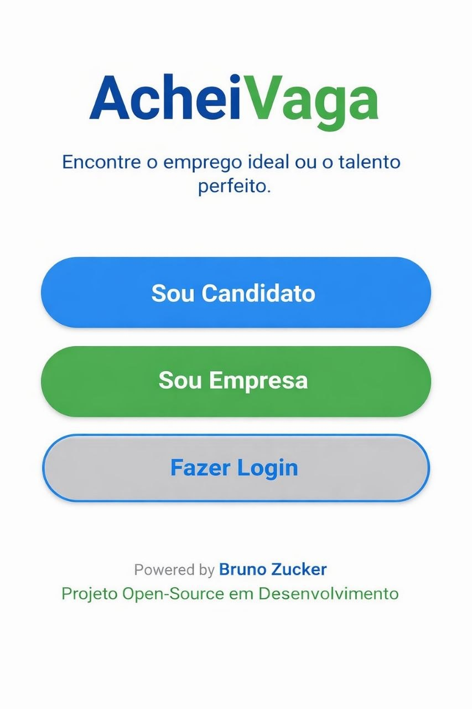
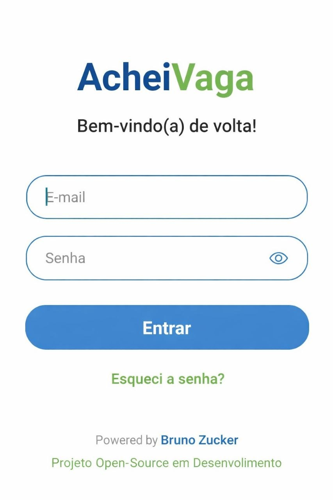
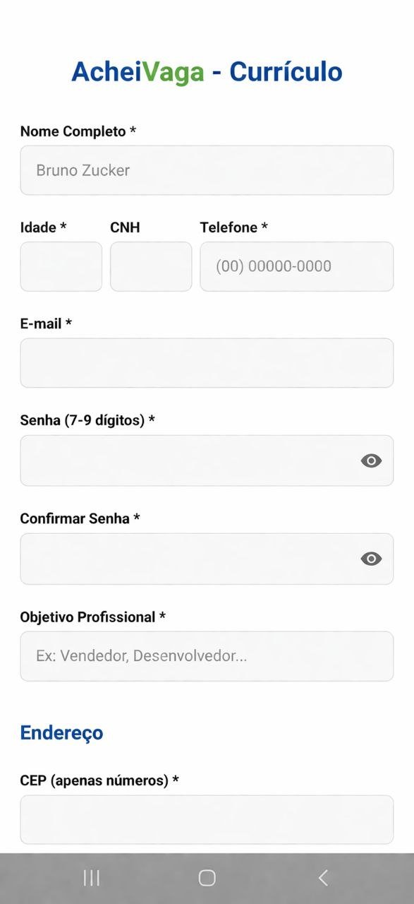
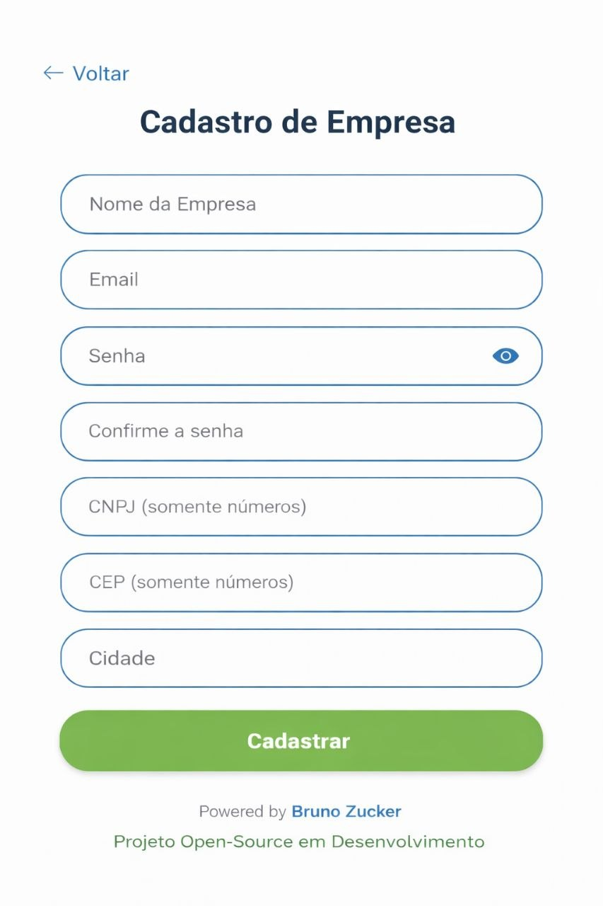
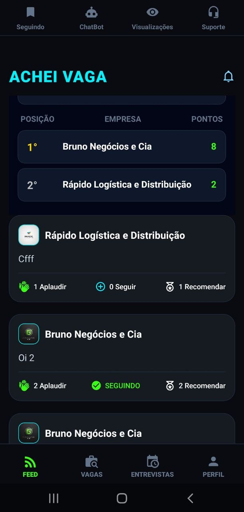
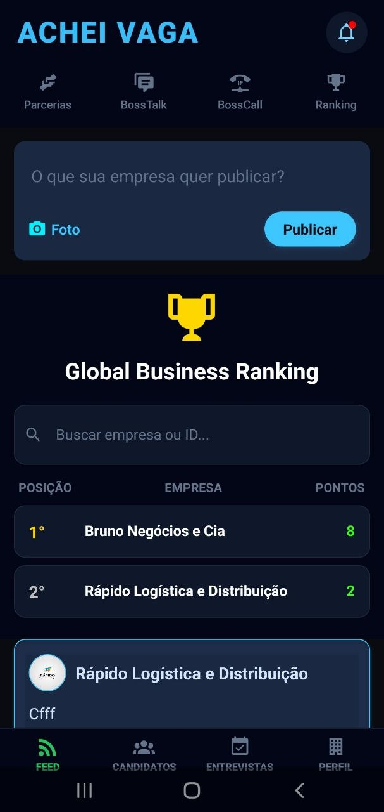
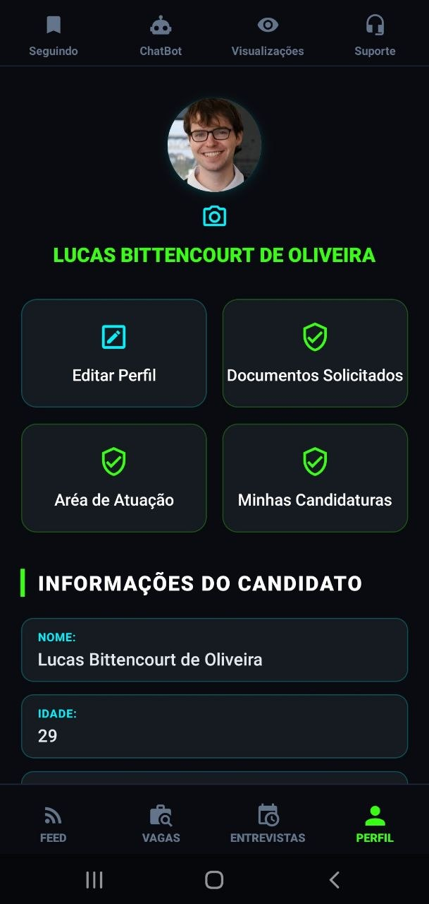
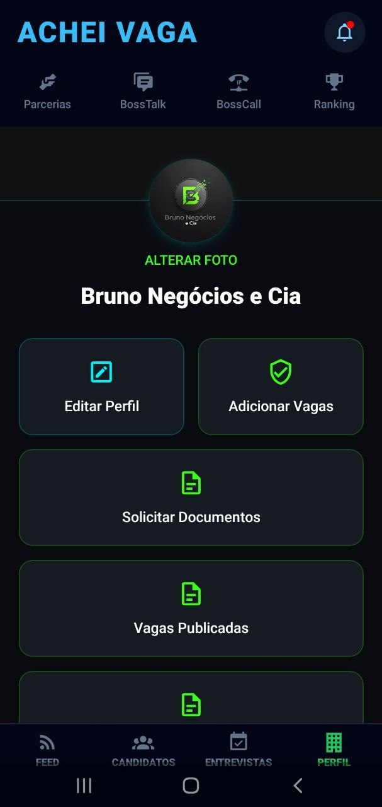
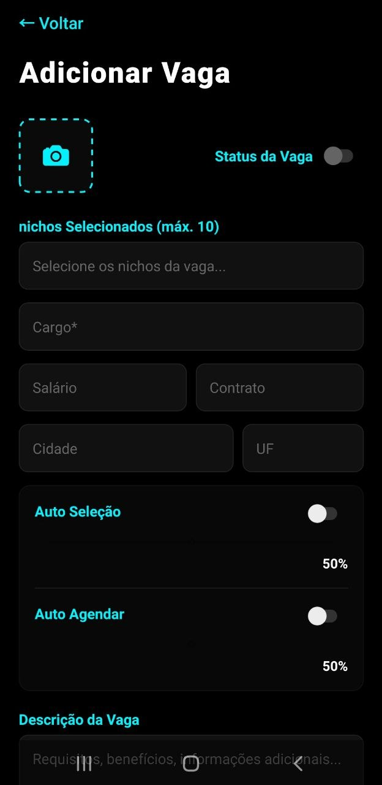
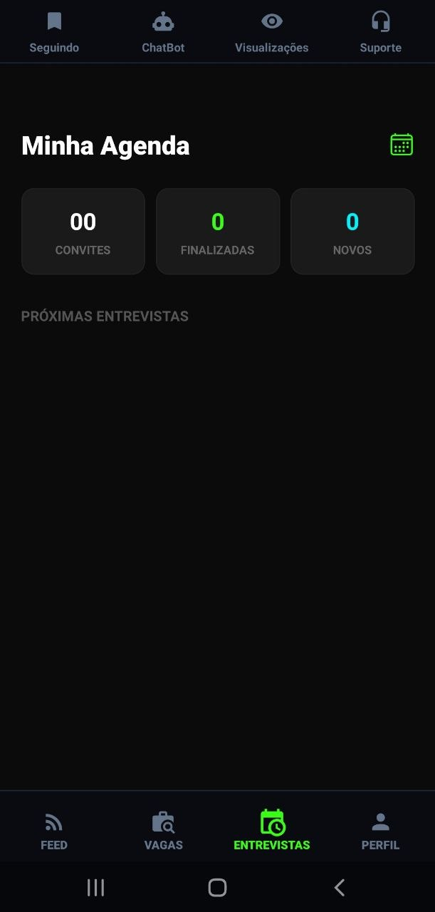
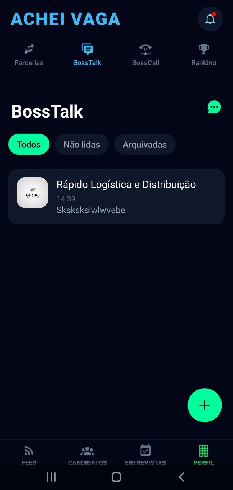
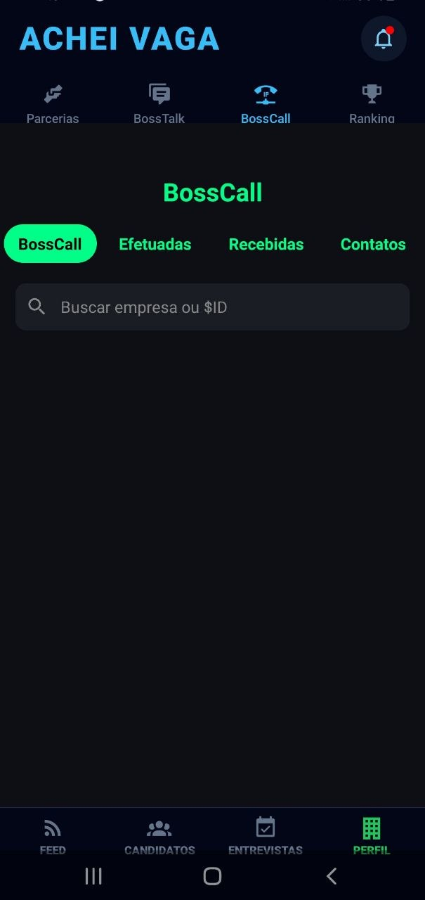
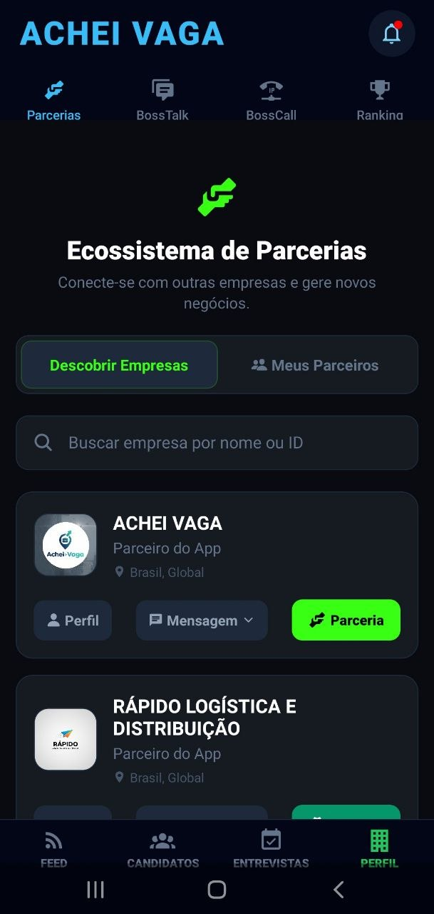
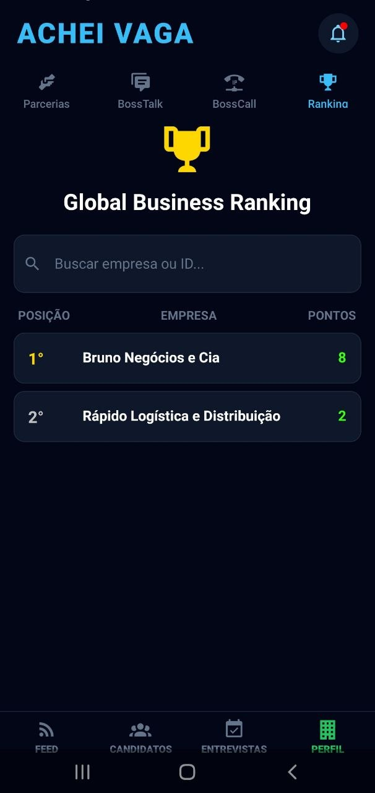


---

**Candidato**
- Tela inicial com acesso a Feed, Vagas, Entrevistas e Perfil
- Feed com posts de empresas, ranking e interações (aplaudir, recomendar, seguir)
- Matching de vagas com barra de compatibilidade por percentual
- Agenda de entrevistas com videochamada integrada
- Perfil com edição de dados, área de atuação, candidaturas e documentos solicitados
- ChatBot para auxiliar na montagem do currículo *(em desenvolvimento)*
- Visibilidade do currículo — quais empresas visualizaram e quando
- Central de suporte com FAQ e chamado técnico
  
---

**Empresa**
- Feed com publicação de posts (texto + foto) e interações
- Visualização de candidatos com swipe (selecionar/recusar) e nível de compatibilidade
- Processo seletivo com auto-seleção e auto-agendamento configuráveis por vaga
- Agenda de entrevistas com videochamada integrada
- BossTalk — chat B2B entre empresas com texto, imagem, áudio e indicador de digitação
- BossCall — chamadas de áudio/vídeo entre empresas com histórico de efetuadas/recebidas
- Ecossistema de Parcerias — descobrir e firmar parcerias com outras empresas
- Global Business Ranking — ranking de empresas por pontos acumulados no feed
- Perfil com edição, gestão de vagas publicadas e solicitação de documentos para admissão
- Solicitação de documentos por ID do candidato ($CDT) com controle de status

---

## Funcionalidades

- Cadastro e login de candidatos e empresas com confirmação por e-mail
- Feed social com ranking embutido
- Matching de vagas e candidatos com cálculo de compatibilidade por múltiplos critérios
- Processo seletivo com auto-seleção e auto-agendamento configuráveis
- Entrevistas via videochamada (Agora.io)
- Chat B2B (BossTalk) com texto, imagem, áudio, fixar, arquivar e indicador de digitação
- Chamadas de áudio/vídeo B2B (BossCall) com histórico
- Ranking global de empresas por pontos
- Ecossistema de parcerias entre empresas
- Solicitação e envio de documentos para admissão
- Notificações push via Expo Notifications
- Visibilidade do currículo para o candidato

---

## Tecnologias

- **React Native** com **Expo SDK 54**
- **Supabase** — Auth, Database (PostgreSQL), Storage, Realtime
- **Agora.io** — videochamada e chamadas de áudio/vídeo B2B
- **React Navigation** — navegação entre telas
- **expo-notifications** — push notifications
- **ViaCEP** — preenchimento automático de endereço por CEP
- **date-fns** — formatação de datas
- **expo-image-picker** — seleção de imagens
- **expo-av** — gravação e reprodução de áudio

---

## Como Rodar

1. Clone o repositório
2. Instale as dependências:
```bash
npm install
```

3. Copie o `.env` e preencha com suas credenciais:
```
EXPO_PUBLIC_SUPABASE_URL=https://seu-projeto.supabase.co
EXPO_PUBLIC_SUPABASE_ANON_KEY=sua_chave_anonima
EXPO_PUBLIC_AGORA_APP_ID=seu_agora_app_id
```

4. Inicie o projeto na rede local (necessário para testar em dispositivo físico via IPv4):
```bash
npx expo start -c --lan
```

> O flag `--lan` é necessário para que o app rode no celular físico conectado na mesma rede. O `-c` limpa o cache do Metro bundler.

---

## Estrutura do Projeto

```
/candidato          → Fluxo completo do candidato (telas, cards, sub-abas)
/empresa            → Fluxo completo da empresa (telas, chat, chamadas, documentos)
/components         → Componentes globais (Login, VideoChamada, Notificações)
/lib                → Configuração do cliente Supabase
App.jsx             → Navegação raiz e gerenciamento de sessão
```

---

## Estado do Projeto

Este é meu **primeiro projeto mobile**, desenvolvido de forma solo como obra em andamento.

A filosofia de desenvolvimento até aqui foi: **fazer funcionar primeiro, lapidar depois.**

Isso significa que você vai encontrar no código:
- Logs de debug (`console.log`) espalhados
- Variáveis e funções ainda não padronizadas em alguns arquivos
- Trechos comentados de funcionalidades planejadas
- Layout funcional mas ainda cru — sem refinamento visual finalizado
- Componentes que serão refatorados em versões futuras

Nada disso é acidente — é o estado natural de uma construção em andamento. Contribuições, issues e sugestões são bem-vindas.

---

## Licença

MIT © 2026 Bruno Zucker
